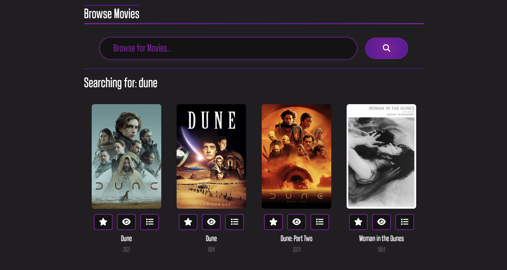
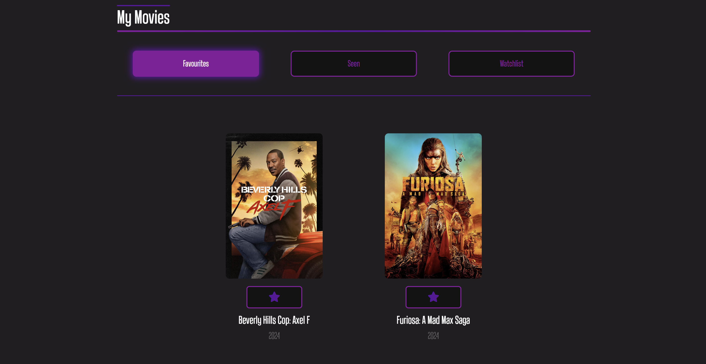

# Welcome to CinnaMate!

To open CinnaMate, clone the repository into a folder, type ```npm i```, wait for the necessary packages to be installed, and then type ```npm run dev``` to access the link to CinnaMate.

## CinnaMate allows you to look for trending films in the main page:


## Browse for any movies that you have watched or would like to watch with the partial search:

## Or the detailed search:


## Easily access the movies that you have added to your lists:


## And create comments on your favourite movies, supporting CRUD operations!


## CinnaMate also supports mobile devices, so you can use it on the run at any time you want!

